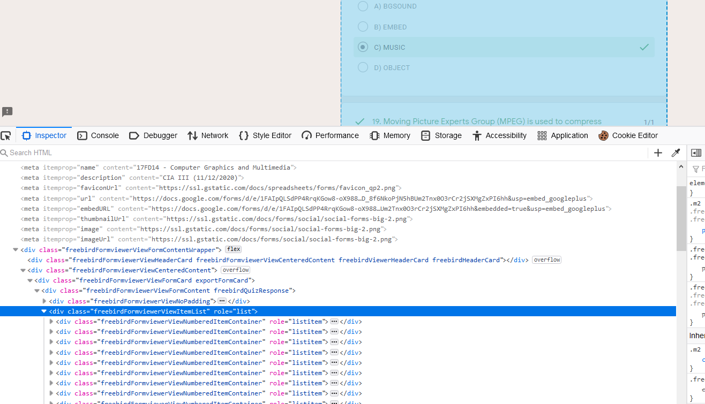
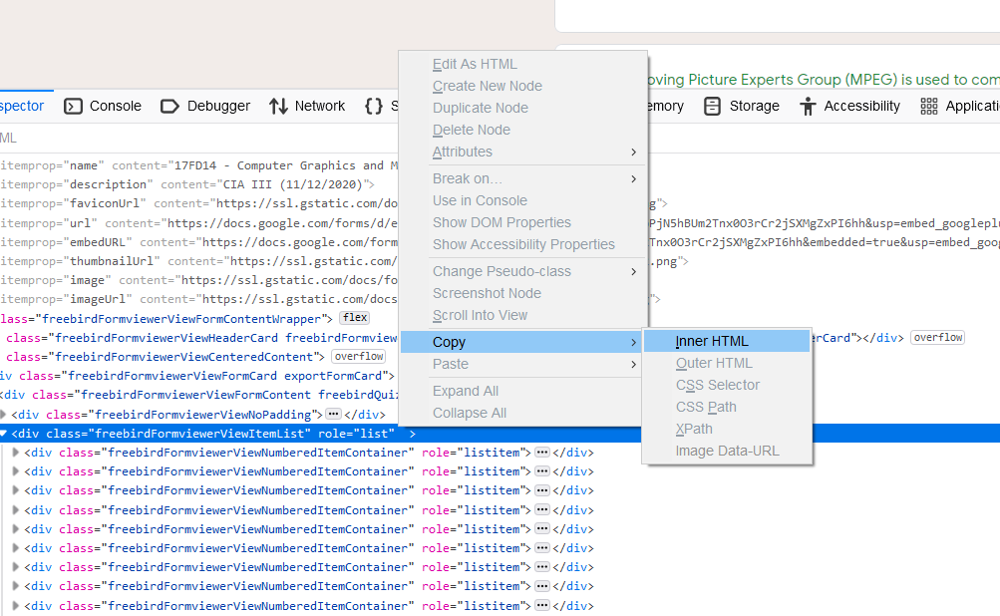

# Googleform-answers
Parse question and answers from google form

##Identify the question answer nodes

##Copy its innerHTML

Paste it in a text editor and save it as html file (page.html here)
import the file and parse the questions and answers

PS: this was done for my quick need, don't @me
